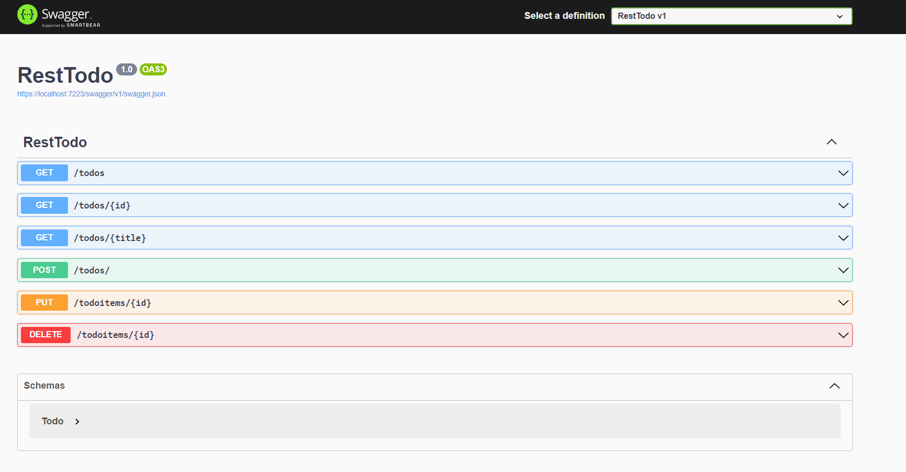

# Simple Rest Api With .net 6 minimal API

this project uses ASP.NET 6 minimal api with:
- swagger 
- EntityFramework 6 In memory Database

 
## Tutorial

> note: make sure dotnet 6 is installed 

just run this command `dotnet run`
that should be it :)
